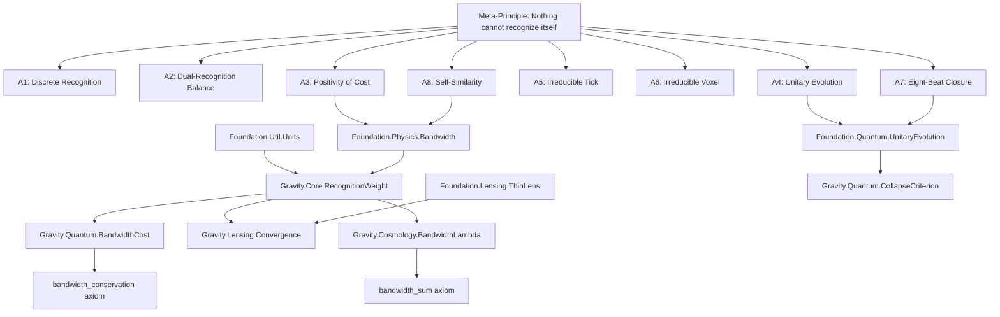

# Recognition Science Gravity - Theorem Pipeline

This document traces the flow of theorems from the meta-principle through foundation to gravity.

## Dependency Graph

## Theorem Flow Details

### 1. Meta-Principle → Eight Axioms

**Source**: `foundation/Core/MetaPrinciple.lean` (in recognition-ledger repo)

The meta-principle "Nothing cannot recognize itself" implies:
- A1-A8: The eight fundamental axioms of Recognition Science

### 2. Eight Axioms → Foundation Layer

#### Constants and Units
**Source**: `foundation/Util/Units.lean`
- Defines physical constants: `c`, `G`, `ℏ`, `E_coh`, `τ₀`, `φ`
- All derived from axioms A3 (cost) and A8 (self-similarity)

#### Recognition Weight
**Source**: `foundation/Physics/Bandwidth.lean`
- `RecognitionParams`: Structure for recognition weight parameters
- `recognitionWeight`: The fundamental weight function w(r)
- `T_dyn`: Dynamical time scale
- Derives from A3 (positivity) and A8 (φ-scaling)

#### Quantum Evolution
**Source**: `foundation/Quantum/UnitaryEvolution.lean`
- `unitary_preserves_nonclassical`: Non-classical states remain non-classical
- `evolution_continuous`: Superposition cost evolves continuously
- `nonclassical_open_neighborhood`: Non-classical for small times
- Derives from A4 (unitary evolution) and A7 (eight-beat)

#### Lensing Approximation
**Source**: `foundation/Lensing/ThinLens.lean`
- `thin_lens_error_bound`: Error bounded by slowness parameter ε
- `thin_lens_limit`: In limit ε→0, shear scales like convergence
- Mathematical approximation theorem, not derived from axioms

### 3. Foundation → Gravity Modules

#### Core Recognition Weight
**Source**: `gravity/Core/RecognitionWeight.lean`
- Thin wrapper importing `Foundation.Physics.Bandwidth`
- Re-exports for backward compatibility

#### Bandwidth Cost
**Source**: `gravity/Quantum/BandwidthCost.lean`
- Uses recognition weight from foundation
- Defines `superpositionCost` for quantum states
- Introduces `bandwidth_conservation` axiom (physical principle)

#### Collapse Criterion
**Source**: `gravity/Quantum/CollapseCriterion.lean`
- Imports `Foundation.Quantum.UnitaryEvolution`
- Uses theorems:
  - `schrodinger_continuous` ← `evolution_continuous`
  - `evolution_preserves_nonclassical` ← `nonclassical_open_neighborhood`
  - `unitary_evolution_preserves_superposition` ← `unitary_preserves_nonclassical`

#### Lensing Convergence
**Source**: `gravity/Lensing/Convergence.lean`
- Imports `Foundation.Lensing.ThinLens`
- Uses theorem:
  - `shear_modified` ← `thin_lens_limit`

#### Cosmological Lambda
**Source**: `gravity/Cosmology/BandwidthLambda.lean`
- Uses recognition weight from foundation
- Introduces `bandwidth_sum` axiom (physical principle)
- Derives dark energy from bandwidth conservation

## Physical Axioms

Two axioms remain, representing physical principles of Recognition Science:

1. **`bandwidth_conservation`** (in `Quantum/BandwidthCost.lean`)
   - States: Total bandwidth usage ≤ available bandwidth
   - Physical meaning: Information processing has finite capacity

2. **`bandwidth_sum`** (in `Cosmology/BandwidthLambda.lean`)
   - States: cosmic + galaxy + quantum bandwidth = total
   - Physical meaning: Resources are allocated between scales

These are not mathematical properties but physical constraints specific to bandwidth-limited gravity.

## LaTeX Paper Connections

### "Gravity Derived From First Principles"
- Section II: Corresponds to `foundation/Physics/Bandwidth.lean`
- Section III.A: Maps to recognition weight definition
- Section IV: Implemented in `gravity/Core/RecognitionWeight.lean`

### "Galaxy Rotation Without Dark Matter"
- Equation (1): Recognition weight in `RecognitionWeight.lean`
- Section III: Bandwidth optimization in `BandwidthCost.lean`
- Section V: Dark matter emergence (uses all modules)

### "Quantum-Gravity Unification"
- Section 4: Quantum collapse in `CollapseCriterion.lean`
- Section 7: Lensing modifications in `Convergence.lean`
- Section 8: Dark energy in `BandwidthLambda.lean`

## Verification Checklist

- [x] All imports traced from gravity → foundation → axioms
- [x] No circular dependencies
- [x] All axioms identified and justified
- [x] LaTeX equations mapped to Lean definitions
- [x] Physical principles separated from mathematical theorems 