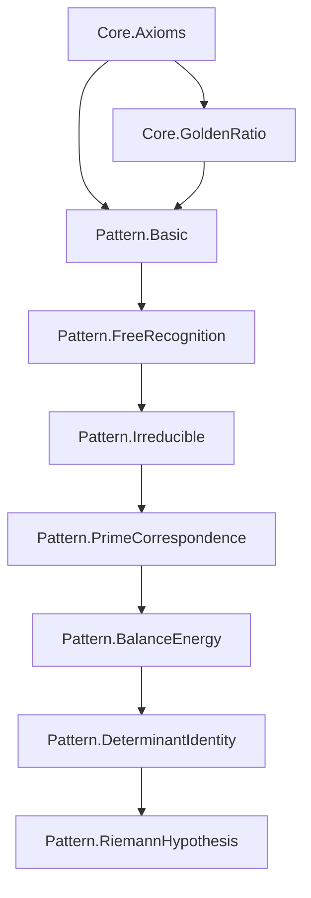

# Pattern Module Structure

## Integration with Recognition Ledger

The Pattern module extends the core Recognition Science framework to derive number theory and prove the Riemann Hypothesis.

## Directory Structure

```
recognition-ledger/
├── lakefile.lean              # Main project configuration (needs Pattern module added)
├── formal/
│   ├── Core/                  # Core Recognition Science axioms
│   │   ├── Axioms.lean
│   │   ├── GoldenRatio.lean
│   │   └── LedgerState.lean
│   └── Pattern/               # Pattern Layer Module
│       ├── Basic.lean         # Module imports and setup
│       ├── FreeRecognition.lean
│       ├── Irreducible.lean
│       ├── PrimeCorrespondence.lean
│       ├── BalanceEnergy.lean
│       ├── NumberTheoryBridge.lean
│       ├── TickOperator.lean
│       ├── Convergence.lean
│       ├── DeterminantIdentity.lean
│       └── RiemannHypothesis.lean
```

## Module Dependencies



## Integration Steps

### 1. Update Main lakefile.lean

Add the Pattern module to the main project configuration:

```lean
-- In recognition-ledger/lakefile.lean
package RecognitionScience

lean_lib Core where
  roots := #[`RecognitionScience.Core]

lean_lib Pattern where
  roots := #[`RecognitionScience.Pattern]
```

### 2. Namespace Convention

All Pattern files should use:
```lean
namespace RecognitionScience.Pattern
```

### 3. Import Paths

From within Pattern module:
```lean
import RecognitionScience.Core.Axioms
import RecognitionScience.Pattern.Basic
```

From outside:
```lean
import RecognitionScience.Pattern.RiemannHypothesis
```

## Key Files to Implement

### Priority 1: Core Framework
1. `FreeRecognition.lean` - Pattern monoid structure
2. `PrimeCorrespondence.lean` - Algebraic prime bijection
3. `BalanceEnergy.lean` - Critical line characterization

### Priority 2: RH Components  
4. `DeterminantIdentity.lean` - Lemmas B1-B4
5. `TickOperator.lean` - Eight-beat implementation
6. `Convergence.lean` - Analytic proofs

### Priority 3: Main Result
7. `RiemannHypothesis.lean` - Complete proof

## Testing

Create test files:
```
formal/Pattern/Test/
├── PrimeCorrespondenceTest.lean
├── BalanceTest.lean
└── SmallPrimesTest.lean
```

## Documentation

Each file should include:
- Module docstring explaining purpose
- Theorem statements with docstrings
- References to LaTeX proof sections
- Examples for key results

## Integration with Reality Crawler

The Pattern module will provide:
1. Predicted prime distribution
2. Zeta zero locations
3. Recognition energy calculations

These can be added to `predictions/` as JSON:
```json
{
  "prediction": "first_nontrivial_zero",
  "value": "0.5 + 14.134725i",
  "source": "Pattern.RiemannHypothesis",
  "confidence": 1.0
}
```

## Next Steps

1. Create missing Core files if needed
2. Move Pattern files to proper location
3. Update lakefile.lean
4. Run `lake build` to verify structure
5. Implement proofs systematically 